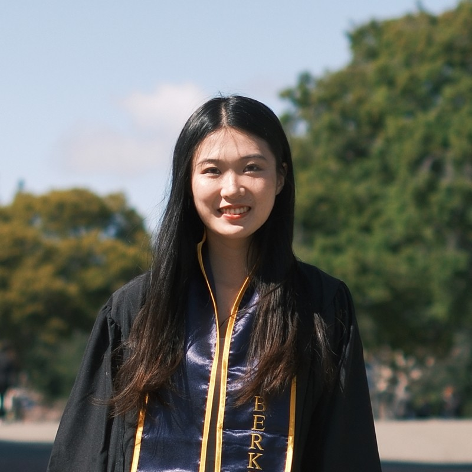

## Here is Yimeng Cai's introduction

Hi there! 
This is Yimeng Cai (Christine as well), graduated from UC Berkeley as a MCB + Econ majors.
I am currently a first year graduate student in Columbia University Mailman School of Public Health studying Biostatistics. 
Here are some basic facts about me:
- Crazy over marine mammals
- ESTJ personality type + Pieces 
- Crazy fan of Kpop, Albert Einstein, and Detective Movie (I know crazy combination)
!!! Currently looking for Data Science or Biostatistician Internship 
Feel free to contact me for any reasons. (Extrovert person loves making friends!)

## How to distinguish me on the street?

## Links to other websites

* [Plotly](yc3577-plotly.html)
* [Flexdashboard](flexdashboard.html)

## Link to my Resume

[Yimeng Cai's Resume](Resume.html)